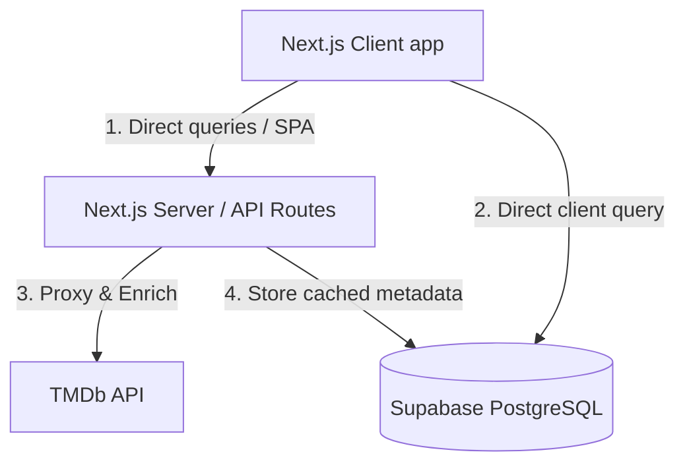

# CineIntel System Architecture

This document describes the high-level system architecture of CineIntel, the Personal Media Operating System.

## Architectural Overview

CineIntel uses a modern hybrid architecture consisting of:
1. **Frontend**: Next.js 16 (App Router) + TypeScript + React 19 + Tailwind CSS v4.
2. **Database & Backend Services**: Supabase (PostgreSQL, Auth, Row-Level Security, Full Text Search).
3. **External Metadata APIs**: TMDb (The Movie Database) API for fetching content details and search results.

---

## Data Caching Strategy (Hybrid TMDb Model)

To enable ultra-fast, customized queries (like custom tags, private ratings, and boolean filtering), we use a hybrid metadata-caching model:

1. **Discovery & Search**:
   - Standard search queries (e.g. typing "Inception" in the search bar) query the TMDb API directly from our Next.js API Routes.
   - We do *not* cache all TMDb data globally, only what is active in our ecosystem.

2. **Inventory Tracking & Caching**:
   - The moment a user interacts with a movie/show (adds it to a watchlist, rates it, adds custom tags), CineIntel inserts/updates a cache record in the local `media_items` table.
   - This records the core search components: English/original titles, alternative names, release year, runtime, directors, main cast (top 10), genres, studios, popularity, and posters.
   - This ensures all tracked items are indexable locally in PostgreSQL for instant, complex operations.

3. **Query Engine**:
   - Power user queries (e.g., `genre:thriller language:korean rating>8`) are executed *locally* on the client/DB across the user's personal inventory and the local cached media database.

---

## Power Search Query Parser

To handle Google-like queries, we implement a client-side (or server-side API route) AST parser.

### Parsing Flow:
1. **Lexical Analysis (Lexer)**: Tokenizes the input string into operators (`AND`, `OR`, `NOT`), field tokens (`genre:`, `actor:`, `rating>`), and full-text search keywords.
2. **Syntax Analysis (Parser)**: Combines tokens into an Abstract Syntax Tree (AST).
3. **Query Translator**: Translates the AST into:
   - A PostgreSQL full-text search query (using `websearch_to_tsquery` or customized `tsquery`).
   - Dynamic PostgREST/Supabase client filter chains.
